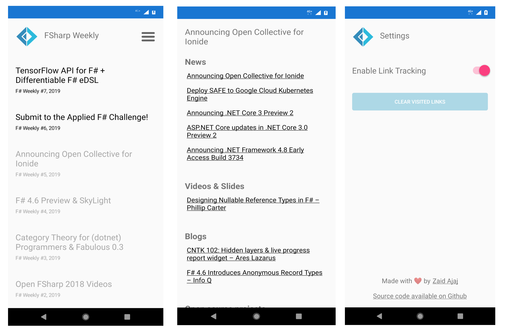
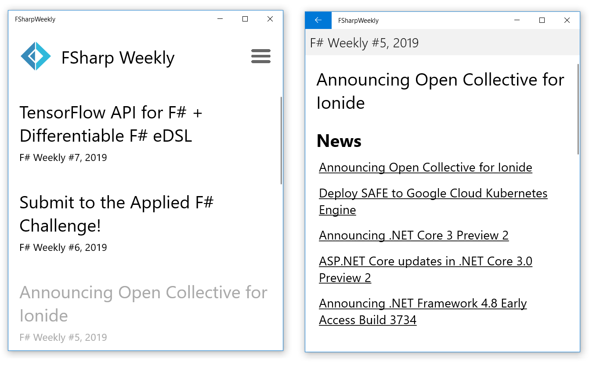
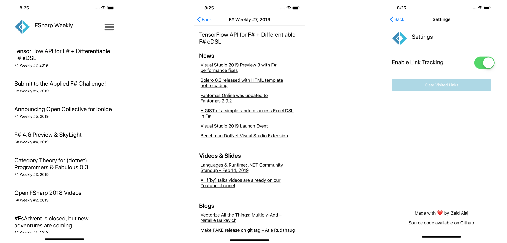

# FSharp Weekly

F# Weekly is a mobile application for Android, iOS and UWP. 

Built in F# (of course) using [Fabulous](https://github.com/fsprojects/Fabulous) and [fabulous-simple-elements](https://github.com/Zaid-Ajaj/fabulous-simple-elements). The application [scrapes](https://github.com/Zaid-Ajaj/fsharp-weekly/blob/master/FSharpWeekly/Scraper.fs) blog entries from [F# Weekly](https://sergeytihon.com/category/f-weekly/), extracts their associated links and renders them on the phone. The application has link tracking: keeps track of the links you already visited. You can disable the link tracking and reset visited links from the settings page.

The main application code can be found in directory FSharpWeekly and contains:
 - [Types.fs](https://github.com/Zaid-Ajaj/fsharp-weekly/blob/master/FSharpWeekly/Types.fs) the type definitions that the application uses
 - [Scraper.fs](https://github.com/Zaid-Ajaj/fsharp-weekly/blob/master/FSharpWeekly/Scraper.fs) functions to parse and extract links from the F# weekly website
 - [FSharpWeekly.fs](https://github.com/Zaid-Ajaj/fsharp-weekly/blob/master/FSharpWeekly/FSharpWeekly.fs) contains the application logic, how the state is updated and how the application is rendered.

Published to:
 - [x] [Play Store](https://play.google.com/store/apps/details?id=coffeedriventeam.fsharpweekly)
 - [ ] Windows Store (WIP)
 - [ ] App Store (Not planned yet)

### Android Screenshots

### Universal Windows Screenshots 

### iOS Screenshots

